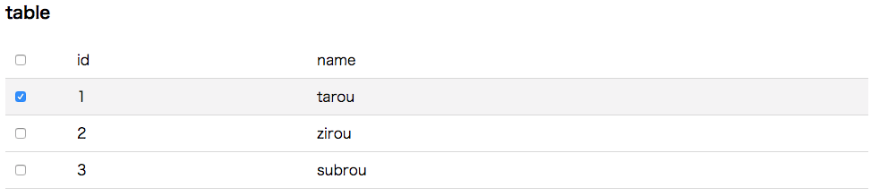

# react-row-select-table

[](https://badge.fury.io/js/react-row-select-table)

simple data table react Component




## Installation
```js
npm i react-row-select-table
```

## Usage

### src
```js
import React from "react"
import Table, {Thead, Tbody, Tr, Th, Td} from "react-row-select-table"

const Custom = () =>  (
  <Table onCheck={value => console.log(value)} defaultCheckeds={[1,3]}>
    <Thead>
      <Tr>
        <Th>id</Th>
        <Th>name</Th>
      </Tr>
    </Thead>
    <Tbody>
      <Tr>
        <Td>1</Td>
        <Td>tarou</Td>
      </Tr>
      <Tr>
        <Td>2</Td>
        <Td>zirou</Td>
      </Tr>
      <Tr>
        <Td>3</Td>
        <Td>subrou</Td>
      </Tr>
    </Tbody>
  </Table>
)
```

### Props
```js
import Table from "react-row-select-table"

render ( <Table onCheck={() => {}} defaultCheckeds={[]} >...)
```

|name|Type|Description|
|:---|:---|:---|
|onCheck|func|Callback checked indexs <br><br>Signature:<br> function(values: Array<number>) => void|
|defaultCheckeds|Array<number>|default checked indexs|

## DEMOS
* examples
  * https://wheatandcat.github.io/examples-pages/react-row-select-table/index.html?v1

* storybook
  * https://wheatandcat.github.io/react-row-select-table/
